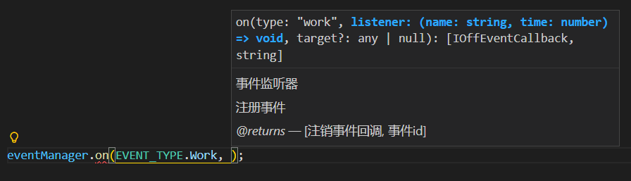
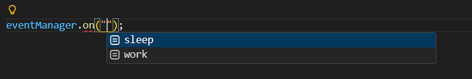
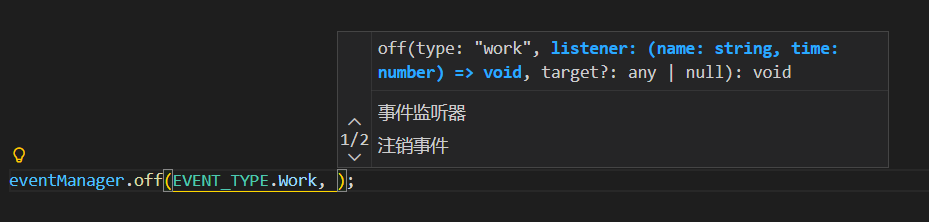
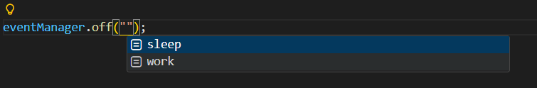
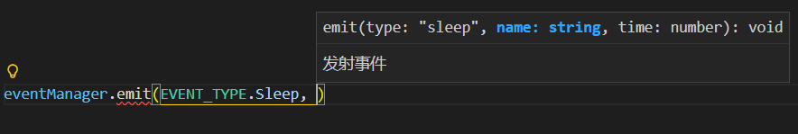
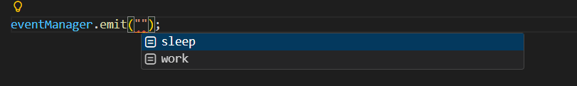

# Event Manager TypeScript
### English | [简体中文](https://github.com/yxdtg/event-manager-typescript/blob/main/README-zh-CN.md)

## 🎉 A Modern TypeScript Event Manager – Easy-to-use, Lightweight, and Developer-friendly.

### 🔒 Type Safety
Enjoy full type hints and validation from event definition to usage, and say goodbye to runtime errors.

### 🧩 Zero Dependencies
Lightweight with no external dependencies, it can be seamlessly integrated into any project.

### 💖 Developer Experience
Every API is designed to deliver an intuitive and human-centric development experience.

## 📦 Installation
```bash
npm install event-manager-typescript

yarn add event-manager-typescript

pnpm add event-manager-typescript
```

## 🚀 Quick Start
```typescript
import { EventManager } from "event-manager-typescript";

// Define event types (highly recommended).
// You can use them either via the strict EVENT_TYPE.XXX or the "xxx" literal value.
// Suitable for both underlying and business logic, especially useful during refactoring.
const EVENT_TYPE = {
    Work: "work",
    Sleep: "sleep",
} as const;
type EVENT_TYPE = typeof EVENT_TYPE[keyof typeof EVENT_TYPE];

// Define event type mapping
interface EVENT_TYPE_MAP {
    [EVENT_TYPE.Work]: (name: string, time: number) => void;
    [EVENT_TYPE.Sleep]: (name: string, time: number) => void;
}

// Literal-based event type mapping (not recommended, but optional)
// interface EVENT_TYPE_MAP {
//     "work": (name: string, time: number) => void;
//     "sleep": (name: string, time: number) => void;
// }

// Create an event manager instance
const eventManager = new EventManager<EVENT_TYPE_MAP>();

// Get all event nodes of the specified event type
const workNodes = eventManager.getEventNodes(EVENT_TYPE.Work);
const sleepNodes = eventManager.getEventNodes(EVENT_TYPE.Sleep);
```

## 🎧 Listening to Events
```typescript
// Listener without a context target
const onWork = (name: string, time: number)  => {
    console.log(`${name} starts working, duration: ${time} minutes.`);
};
eventManager.on(EVENT_TYPE.Work, onWork);

// Listener with a context target
const target = {};
eventManager.on(EVENT_TYPE.Work, onWork, target);

// Returns the unsubscription function and event ID
const [offSleep, sleepId] = eventManager.on(EVENT_TYPE.Sleep, (name, time) => {
    console.log(`${name} starts sleeping, duration: ${time} minutes.`);
});
```
* Parameter Type Hints

* Literal Event Type Hints


## 🚫 Unsubscribing from Events
```typescript
// Unsubscribe via the bound listener and context target
eventManager.off(EVENT_TYPE.Work, onWork);
eventManager.off(EVENT_TYPE.Work, onWork, target);

// Unsubscribe via the returned unsubscription function
offSleep();

// Unsubscribe via the returned event ID
eventManager.off(sleepId);

// Unsubscribe all events of the specified type
eventManager.offAll(EVENT_TYPE.Work);
eventManager.offAll(EVENT_TYPE.Sleep);

// Unsubscribe all events
eventManager.offAll();
```
* Parameter Type Hints

* Literal Event Type Hints


## 🚀 Emitting Events
```typescript
eventManager.emit(EVENT_TYPE.Work, "Alice", 30);
eventManager.emit(EVENT_TYPE.Sleep, "Bob", 15);
```
* Parameter Type Hints

* Literal Event Type Hints


## 🧩 Generating Info
```typescript
const info = eventManager.generateInfo();
console.log(info);
```

## 🛠️ Development

### Dependencies

- **[TypeScript](https://www.typescriptlang.org/)**: TypeScript is a strongly typed programming language that builds on JavaScript, giving you better tooling at any scale.
- **[tsdown](https://tsdown.dev/)**: An elegant library bundler
- **[nodemon](https://nodemon.io/)**: Monitors for any changes in your source code and automatically restarts the server.

### Install Dependencies

```bash
npm install
```

### Development

```bash
npm run dev
```

### Build
```bash
npm run build
```